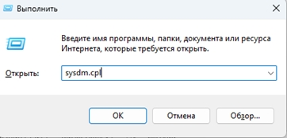
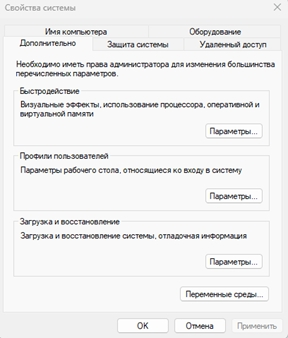
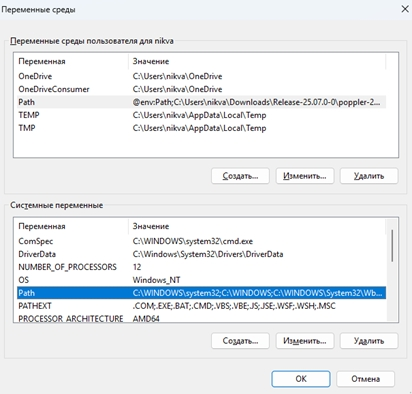
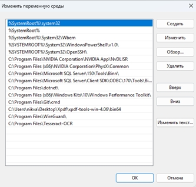

# Инструкция по установке и настройке окружения

## Требования

Перед началом работы необходимо установить следующее программное обеспечение:

- **Qt** версии **6.9.3** или новее
- **PostgreSQL 18**

## Установка дополнительных компонентов

1. Распакуйте библиотеку **Xpdf**.
2. Установите систему компьютерного зрения **Tesseract OCR**.

## Настройка переменных среды

1. Нажмите **Win + R**, введите `sysdm.cpl` и нажмите Enter.

   

2. В открывшемся окне перейдите на вкладку **«Дополнительно»** и нажмите **«Параметры среды»**.

   

3. В разделе «Системные переменные» найдите переменную **Path**, выделите её и нажмите **«Изменить»**.

   

4. Нажмите **«Создать»** и добавьте пути к установленным компонентам, как показано на изображении ниже:

   

## Примечание

Убедитесь, что все пути указаны верно, чтобы компоненты корректно работали из командной строки и окружения разработки.